# 🎨 HobbyHub

A Flutter-based social mobile application that connects people through shared hobbies and interests — combining personalized content discovery with a location-based "Nearby Friends" system for finding hobby partners close to you.

---

## 📱 About the Project

HobbyHub is a social platform built for people who want to connect over shared passions rather than a generic social feed. Users select their hobbies during onboarding, get a personalized feed based on those interests, and can discover and connect with nearby users who share the same hobbies — visualized through three different map views.

---

## ✨ Features

### Core Social Features
- **Authentication** — Secure sign up / login with Firebase Auth
- **Hobby Selection** — Choose from 15+ hobbies during onboarding
- **Personalized Feed** — Content tailored to selected interests, refreshes automatically when interests change
- **Posts** — Create posts with images and captions
- **Likes & Comments** — Real-time like toggle and commenting system (no page refresh needed)
- **Explore Screen** — Discover content beyond your feed
- **Public Profiles** — View any user's profile and their public posts

### 📍 Nearby Friends (Flagship Feature)
- **Three Visualization Modes**, switchable via toggle:
  - **Map View** — Real Google Maps integration with GPS and custom markers
  - **Radial View** — A custom-built, animated distance-ring map showing nearby users as color-coded bubbles around a pulsing "You" marker
  - **List View** — Classic distance-sorted list
- **Hobby Filters** — Filter nearby users by shared interests
- **Location Selector** — Choose city and specific area across 11 major Pakistani cities and 300+ localities for precise matching
- **Privacy-Friendly** — Only area-level location is shared, never exact GPS coordinates with other users
- **Message Notification** — Placeholder messaging system with a "coming soon" notification flow

### Profile & Personalization
- Editable user profile with bio, profile picture, and hobbies
- Hobby detail pages
- Location settings (city/area)

---

## 📱 Screenshots

### Onboarding & Authentication
<p float="left">
  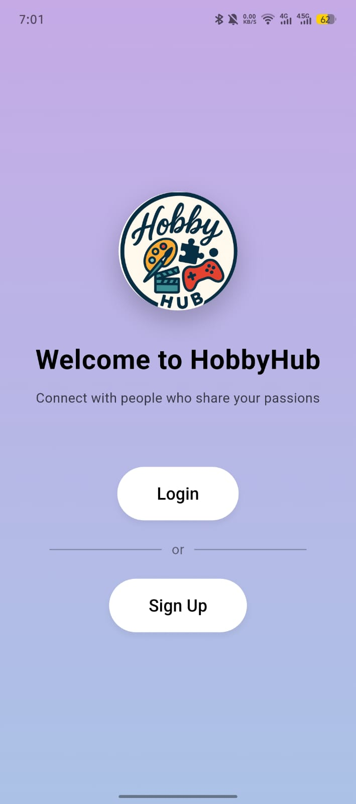
  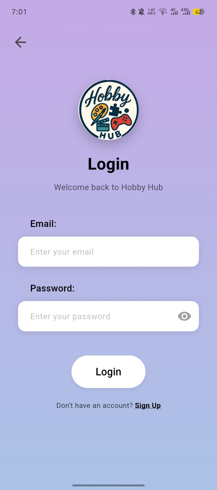
  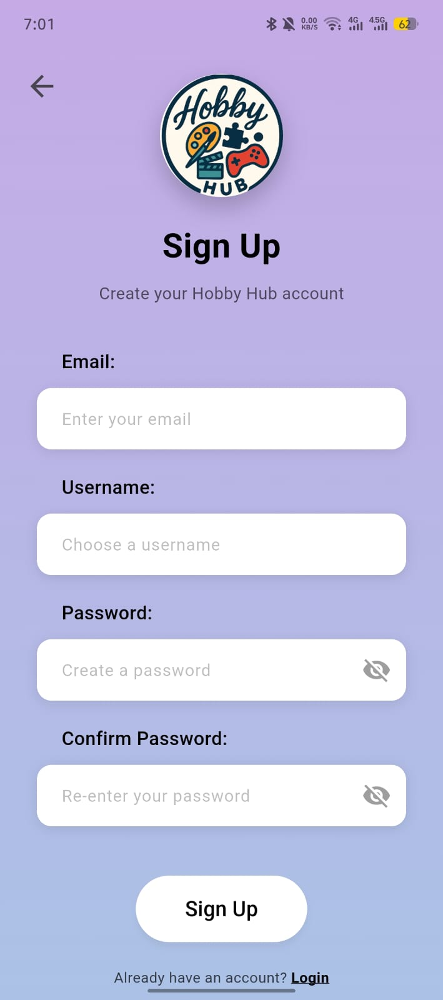
  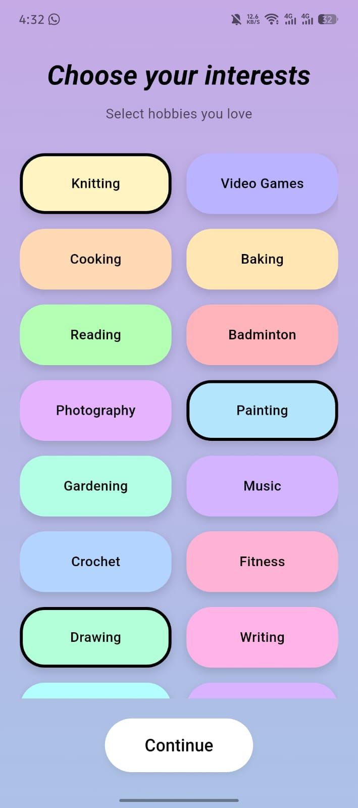
</p>

### Home Feed & Profile
<p float="left">
  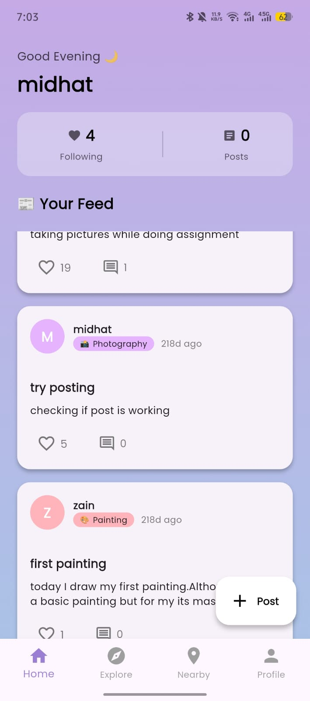
  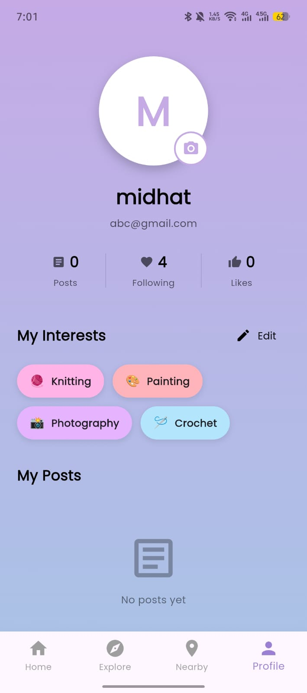
</p>

### 📍 Nearby Friends — Map, Radial & List Views
<p float="left">
  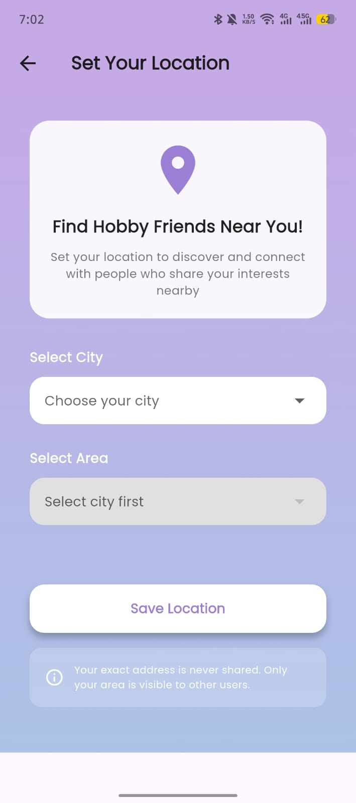
  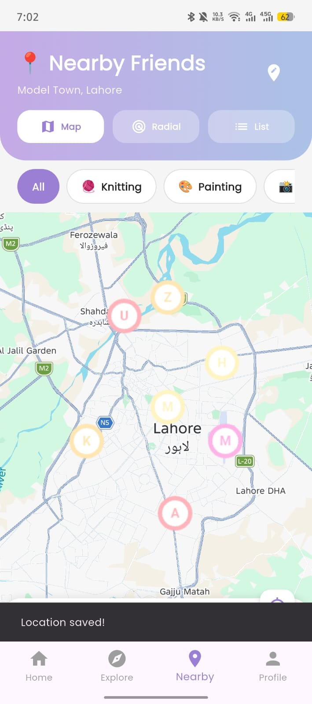
  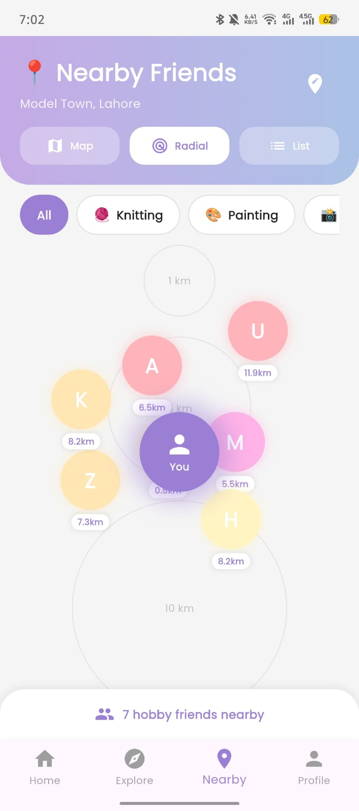
  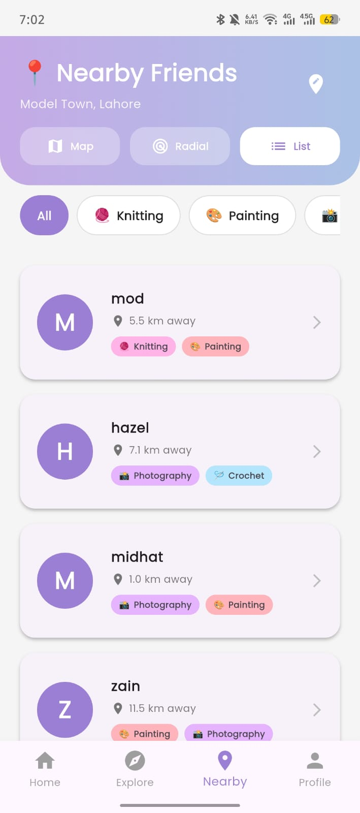
</p>

### Explore & Hobby Details
<p float="left">
  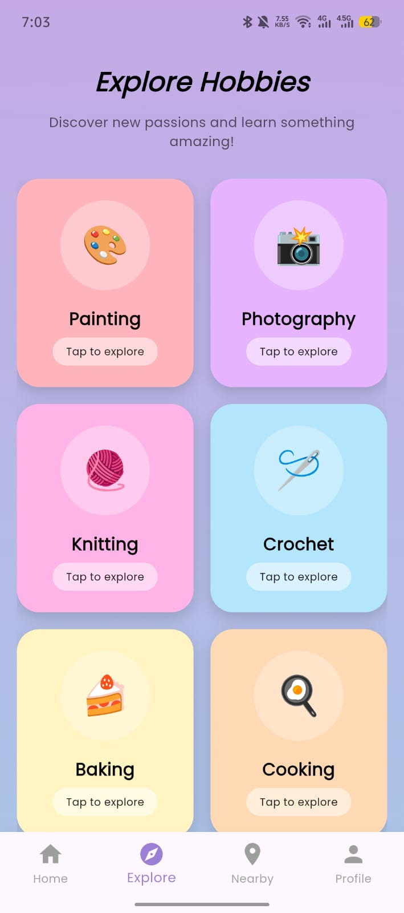
  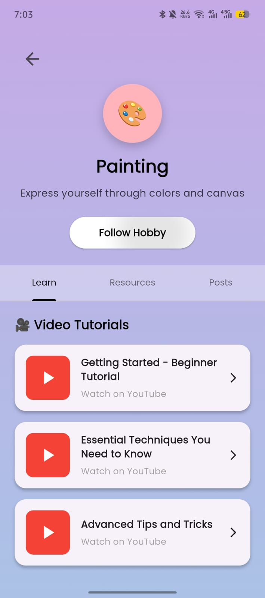
</p>

---

## 🛠️ Tech Stack

| Category | Technology |
|---|---|
| Framework | Flutter |
| Language | Dart |
| Backend | Firebase (Authentication, Cloud Firestore, Storage) |
| Maps | Google Maps SDK for Android |
| Location | Geolocator, Geocoding |
| Image Handling | Image Picker |
| State Management | StatefulWidget / StreamBuilder (real-time Firestore streams) |

---

## 🚀 Getting Started

### Prerequisites
- Flutter SDK installed
- A Firebase project (Authentication, Firestore, Storage enabled)
- A Google Maps API key (Maps SDK for Android enabled)

### Installation

```bash
# Clone or extract the project
cd final_project

# Install dependencies
flutter pub get

# Run the app
flutter run
```

### Configuration
1. Add your `google-services.json` to `android/app/`
2. Add your Google Maps API key to `android/app/src/main/AndroidManifest.xml`
3. Ensure Firestore rules allow authenticated read/write for `users` and `posts` collections

---

## 🗺️ Firebase Data Structure

```
users/
└── {userId}
    ├── username
    ├── email
    ├── city
    ├── area
    ├── interests: []
    └── profilePicture

posts/
└── {postId}
    ├── userId
    ├── caption
    ├── imageUrl
    ├── hobby
    ├── likes: []
    └── comments: []
```

---

## 👥 Team

| Member | Role | Key Contributions |
|---|---|---|
| **Midhat Fatima** | Group Leader | Authentication, Location/Nearby Friends system (Maps, Radial, List views), Home Feed |
| **Samar** | Member | Post creation, Like & Comment system, Explore Screen, Public Profiles |
| **Khizra** | Member | User Profile system, Hobby Detail pages, Data models, Firebase setup |

---

## 🌟 What Makes HobbyHub Different

Unlike generic social media clones, HobbyHub is built specifically around **hobby-based connection**:
- A custom radial map visualization not found in typical social apps
- Multiple ways to discover nearby people based on real shared interests
- Privacy-conscious location sharing (area-level, not exact GPS)
- Wide, precise location coverage across 11 cities and 300+ localities

---

## 📌 Future Enhancements
- In-app real-time messaging
- Hobby-based groups and communities
- Skill-level badges and progress tracking
- Event/meetup scheduling for hobby groups

---

## 📄 License
This project was developed as a final academic project for educational purposes.
